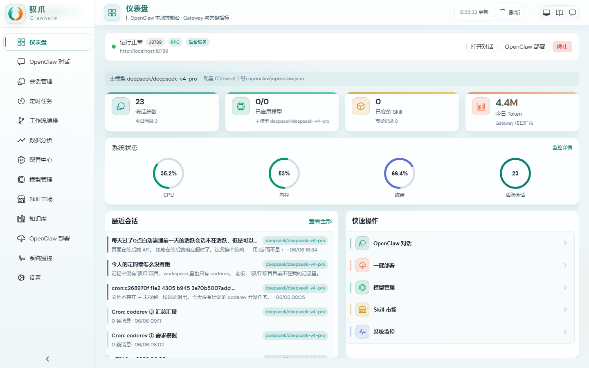
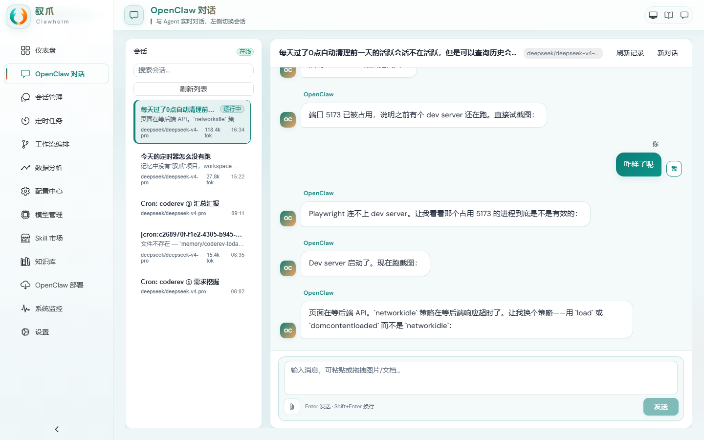
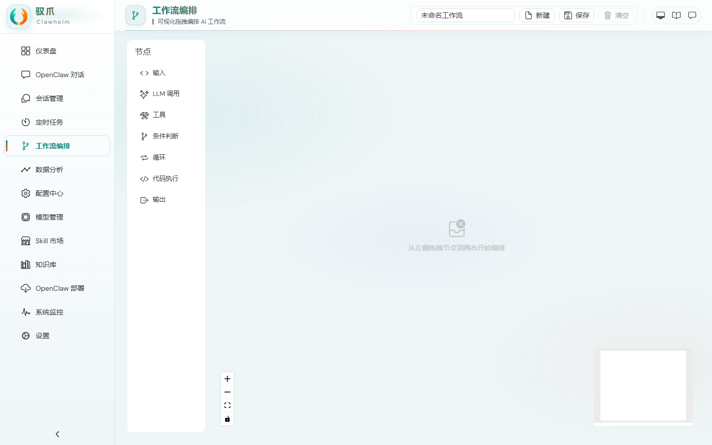
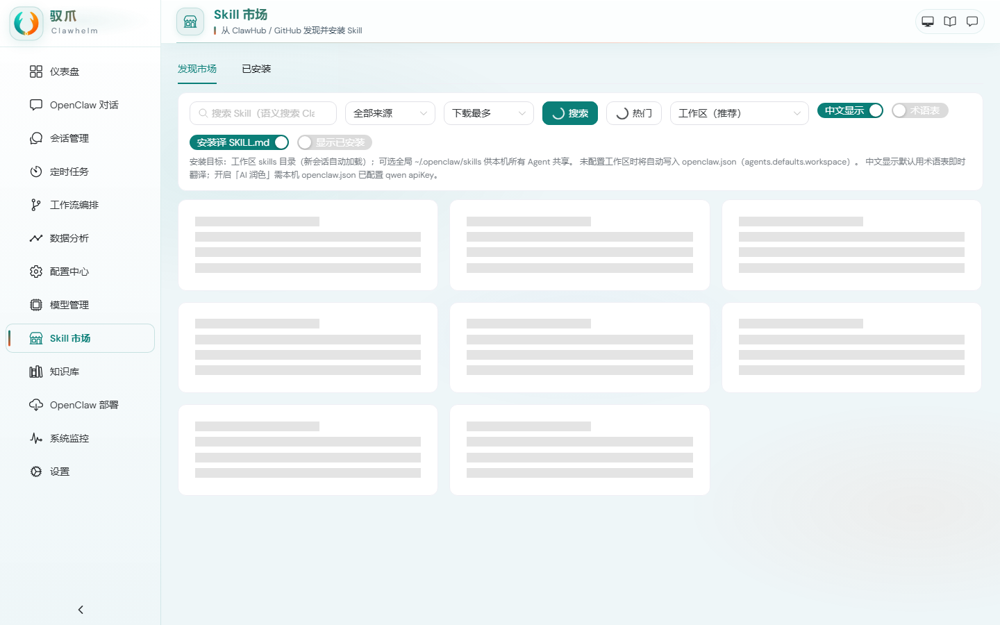
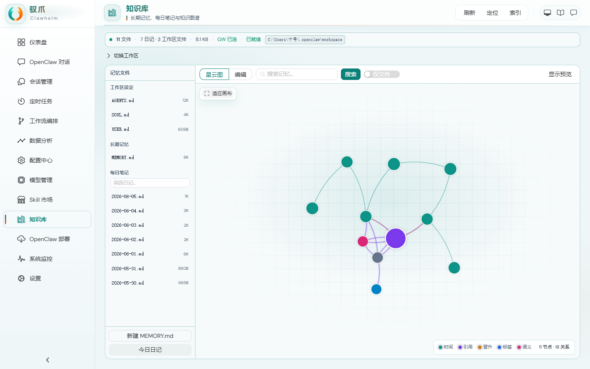
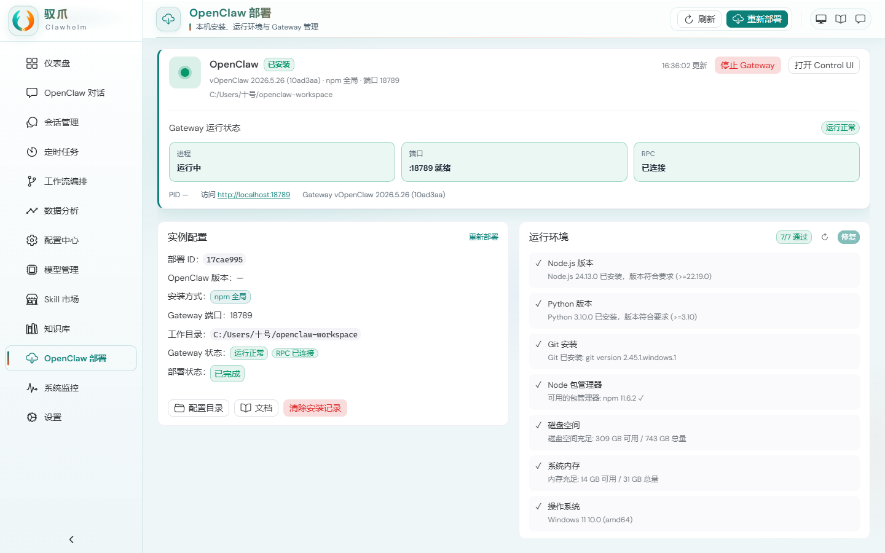
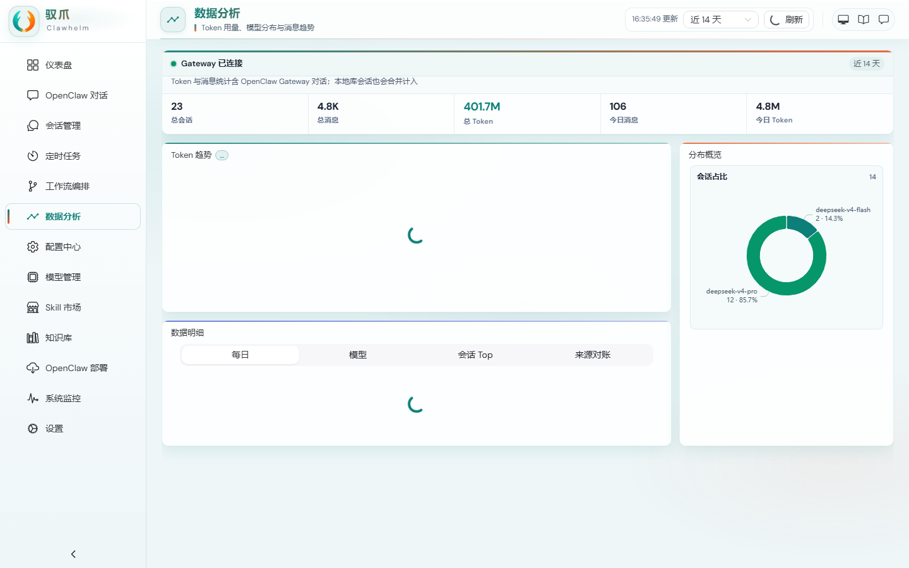
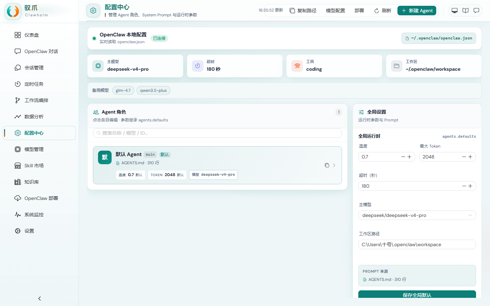

<p align="center">
  <picture>
    <source media="(prefers-color-scheme: dark)" srcset="assets/icon-openclaw-v3.png">
    
  </picture>
</p>

<h1 align="center">驭爪 Clawhelm</h1>

<p align="center">
  <strong>在本机掌舵 OpenClaw</strong><br>
  AI Agent 桌面控制台 — 对话 · 模型管理 · 部署 · 知识库 · 定时任务 · 工作流 · 监控
</p>

<p align="center">
  <a href="https://github.com/jishuanjimingtian/openclaw-visual-studio/releases"></a>
  <a href="https://github.com/jishuanjimingtian/openclaw-visual-studio/blob/main/LICENSE"></a>
  <a href="https://github.com/jishuanjimingtian/openclaw-visual-studio/stargazers"></a>
  
  
  
  
</p>

---

## 什么是驭爪？

**驭爪（Clawhelm）** 是 [OpenClaw](https://github.com/openclaw/openclaw) 的全功能本地桌面控制台——用 Electron + Vue 3 打造，Spring Boot 驱动。把命令行里的 AI Agent 搬到直观的图形界面上，**不用敲命令、不用配环境，装完就能用**。

> 驭为驾驭，Helm 为舵轮——在本机掌舵你的 AI。

### 为什么需要驭爪？

OpenClaw 本身是命令行驱动的 AI Agent 引擎，功能强大但上手门槛高：Gateway 配置、模型管理、会话切换、定时任务编排都要靠命令和配置文件。驭爪把这一切变成可视化操作：

- 🖱️ **告别命令行** — 所有操作用界面完成，零学习成本
- 🔌 **自动连接 Gateway** — 启动即连，实时显示连接状态
- 📦 **一键部署 OpenClaw** — 内置 npm/GitHub 安装流程，环境检测 + 自动修复
- 💾 **本地数据主权** — 所有对话、配置、知识库存在本机，不上传云端

---

## 功能模块

| 模块 | 图标 | 说明 |
|------|:----:|------|
| **仪表盘** | 📊 | Gateway 状态、系统资源、模型用量、最近对话，一站式总览 |
| **对话** | 💬 | 多会话实时聊天，支持附件（图片/文件）、流式输出、会话历史 |
| **会话管理** | 🗂 | 浏览/搜索/归档所有 Gateway 会话，同步到本地库，查看 Token 用量 |
| **模型管理** | 🧠 | 模型市场浏览、API Key 配置、OpenClaw 配置同步、模型连通性测试 |
| **配置中心** | ⚙️ | Agent 角色管理、System Prompt 编辑（Monaco Editor）、运行时参数可视化 |
| **定时任务** | ⏱ | cron 定时任务 CRUD、执行历史、投递状态、一键触发 |
| **工作流编排** | 🔀 | 拖拽式可视化编排 AI 工作流（LLM / Tool / Condition / Loop 节点） |
| **数据分析** | 📈 | Token 用量趋势、模型分布饼图、消息量统计、成本估算 |
| **Skill 市场** | 🛒 | 从 ClawHub 和 GitHub 发现、安装、更新 Skill，支持中文本地化 |
| **知识库** | 📚 | 长期记忆文件管理、知识图谱可视化、语义搜索、索引管理 |
| **部署管理** | 🚀 | OpenClaw 环境检测、一键安装、版本管理、Gateway 启停 |
| **系统监控** | 📡 | 实时 CPU/内存/磁盘、会话活跃度、Gateway 健康度 |
| **设置** | 🔧 | 应用偏好、Gateway 连接地址、数据目录、更新检查、关于 |

---

## 预览

<p align="center">
  
  
</p>
<p align="center">
  
  
</p>
<p align="center">
  
  
</p>
<p align="center">
  
  
</p>

> 📸 **[查看全部 13 张截图 →](docs/screenshots/)**

---

## 快速开始

### 普通用户 — 安装即用

从 [Releases](https://github.com/jishuanjimingtian/openclaw-visual-studio/releases) 页面下载对应平台的安装包：

| 平台 | 安装包 | 说明 |
|------|--------|------|
| **Windows** | `Clawhelm-x.y.z-setup.exe` | 双击安装，内置 JRE，桌面快捷方式 |
| **macOS** | `Clawhelm-x.y.z.dmg` | 拖入 Applications |
| **Linux** | `Clawhelm-x.y.z.AppImage` | 赋予执行权限后运行 |

Windows 完整版内置 Java 运行时，无需预装 Java。轻量版（`-lite` 后缀）需目标机器已安装 Java 17+。

### 开发者 — 从源码运行

#### 环境要求

| 工具 | 最低版本 |
|------|---------|
| Node.js | 20+ |
| Java | 21 |
| Maven | 3.8+ |
| Git | 任意 |

#### 克隆并启动

```bash
git clone https://github.com/jishuanjimingtian/openclaw-visual-studio.git
cd openclaw-visual-studio

npm install

# 终端 1：启动前端 Electron + Vue
npm run dev

# 终端 2：启动后端 Spring Boot
cd backend && mvn spring-boot:run -Dspring-boot.run.profiles=dev
```

| 服务 | 端口 | 说明 |
|------|------|------|
| Vue 开发服务器 | `5173` | 热更新，自动打开浏览器 |
| Spring Boot API | `8089` | context-path: `/api/v1` |
| H2 Console（dev） | `8089` | `/api/v1/h2-console` |

#### 打包发布

```bash
npm run package:win          # Windows 完整版（内置 JRE）
npm run package:win:lite     # Windows 轻量版（需 Java 17+）
npm run package:mac          # macOS DMG
npm run package:linux        # Linux AppImage
```

打包产物输出到 `out/` 目录。安装包大小（完整版）约 **80-120 MB**（含 Electron + JRE + Spring Boot + Vue 前端）。

---

## 架构

```
┌─────────────────────────────────────────────────────┐
│                 Electron 33 桌面壳                    │
│  ┌───────────────────────────────────────────────┐  │
│  │           Vue 3 + TypeScript UI               │  │
│  │  ┌─────┐ ┌──────┐ ┌──────┐ ┌──────────┐      │  │
│  │  │对话 │ │工作流 │ │模型  │ │Skill市场 │ ...  │  │
│  │  └─────┘ └──────┘ └──────┘ └──────────┘      │  │
│  │         Pinia 状态管理 · Monaco 编辑器         │  │
│  └───────────────────────────────────────────────┘  │
│                      ↕ HTTP / WebSocket              │
│  ┌───────────────────────────────────────────────┐  │
│  │         Spring Boot 3 后端服务                 │  │
│  │  ┌────┐ ┌────────┐ ┌───────┐ ┌──────────┐   │  │
│  │  │REST│ │Gateway │ │ Cron  │ │Knowledge │   │  │
│  │  │API │ │WebSocket│ │ Proxy │ │ Graph    │   │  │
│  │  └────┘ └────────┘ └───────┘ └──────────┘   │  │
│  │           H2 数据库 · Flyway 迁移              │  │
│  └───────────────────────────────────────────────┘  │
│                      ↕ WebSocket (ws://127.0.0.1)    │
│  ┌───────────────────────────────────────────────┐  │
│  │         OpenClaw Gateway (18789)               │  │
│  └───────────────────────────────────────────────┘  │
└─────────────────────────────────────────────────────┘
```

**数据流向：**
- 前端 Vue ↔ 后端 Spring Boot：REST API（HTTP JSON）
- 后端 ↔ OpenClaw Gateway：WebSocket（实时双向通信）
- 流式对话响应由 Gateway WebSocket 推送，后端 SSE 转发到前端

---

## 技术栈

| 层 | 技术 | 版本 |
|----|------|------|
| **桌面壳** | Electron | 33 |
| **前端框架** | Vue 3 + Composition API | 3.5 |
| **类型系统** | TypeScript | 5.7 |
| **UI 组件库** | Naive UI | 2.41 |
| **状态管理** | Pinia（持久化） | 2.3 |
| **代码编辑器** | Monaco Editor | 0.52 |
| **图表** | ECharts + vue-echarts | 5.5 |
| **工作流画布** | Vue Flow | 1.41 |
| **后端框架** | Spring Boot | 3 |
| **数据库** | H2（嵌入式）/ PostgreSQL（可选） | — |
| **数据库迁移** | Flyway | — |
| **构建工具** | Vite + Maven + electron-builder | — |
| **测试** | Vitest + Playwright + JUnit 5 | — |
| **自动更新** | electron-updater | 6.8 |

---

## 项目结构

```
openclaw-visual-studio/
├── frontend/                  # Electron + Vue 3 前端
│   ├── src/main/              # Electron 主进程（窗口管理、系统指标、更新）
│   ├── src/renderer/          # Vue 3 渲染进程
│   │   ├── views/             # 13 个页面视图
│   │   │   ├── dashboard/     #   仪表盘
│   │   │   ├── chat/          #   对话
│   │   │   ├── sessions/      #   会话管理
│   │   │   ├── timers/        #   定时任务
│   │   │   ├── workflow/      #   工作流编排
│   │   │   ├── analytics/     #   数据分析
│   │   │   ├── config/        #   配置中心
│   │   │   ├── models/        #   模型管理
│   │   │   ├── marketplace/   #   Skill 市场
│   │   │   ├── knowledge/     #   知识库
│   │   │   ├── deployment/    #   部署管理
│   │   │   ├── monitor/       #   系统监控
│   │   │   └── settings/      #   设置
│   │   ├── components/        # 通用组件
│   │   ├── composables/       # 组合式 API
│   │   ├── stores/            # Pinia 状态仓库
│   │   ├── router/            # 路由配置
│   │   └── styles/            # 样式
│   ├── src/preload/           # Electron 预加载脚本
│   ├── src/shared/            # 前后端共享类型
│   ├── resources/             # 图标 / Logo
│   └── tests/                 # 前端测试
│       ├── unit/              # 单元测试 (Vitest)
│       └── e2e/               # E2E 测试 (Playwright)
├── backend/                   # Spring Boot 后端
│   └── src/main/java/com/openclaw/vs/
│       ├── config/            # Spring 配置
│       ├── controller/        # 18 个 REST 控制器
│       ├── service/           # 30+ 业务服务
│       ├── gateway/           # Gateway WebSocket 客户端
│       ├── model/             # JPA 实体
│       ├── repository/        # 数据访问层
│       ├── dto/               # 100+ 数据传输对象
│       └── util/              # 工具类
├── docs/                      # 项目文档
│   ├── chat-attachments-protocol.md
│   └── screenshots/           # 13 张页面截图
├── scripts/                   # 构建 & 辅助脚本
│   ├── package-win.mjs        # Windows 打包
│   ├── download-jre.mjs       # JRE 下载
│   ├── screenshot.mjs         # 自动截图
│   ├── electron-builder.config.mjs
│   ├── prepare-packaging.mjs
│   └── ...
└── assets/                    # Logo 资源
```

---

## API 接口一览

后端提供 18 个 REST Controller，覆盖所有前端功能：

| Controller | 路径前缀 | 功能 |
|------------|---------|------|
| DashboardController | `/api/v1/dashboard` | 仪表盘总览 |
| OpenClawChatController | `/api/v1/openclaw/chat` | 对话流式通信 |
| ConversationController | `/api/v1/conversations` | 本地会话 CRUD |
| MessageController | `/api/v1/messages` | 消息管理 |
| ChatAttachmentController | `/api/v1/chat-attachments` | 附件上传 |
| OpenClawCronController | `/api/v1/openclaw/cron` | 定时任务代理 |
| ModelController | `/api/v1/models` | 模型配置管理 |
| AgentRoleController | `/api/v1/agent-roles` | Agent 角色 CRUD |
| SkillController | `/api/v1/skills` | 已安装技能管理 |
| SkillMarketController | `/api/v1/skill-market` | 技能市场浏览/安装 |
| KnowledgeController | `/api/v1/knowledge` | 知识库/图谱 |
| GatewayController | `/api/v1/gateway` | Gateway 状态/操作 |
| DeploymentController | `/api/v1/deployment` | 一键部署 |
| AnalyticsController | `/api/v1/analytics` | 数据分析 |
| EnvironmentFixController | `/api/v1/environment-fix` | 环境自动修复 |
| SystemMetricsService* | — | 系统指标采集 |

---

## 环境变量

| 变量 | 说明 | 默认值 |
|------|------|--------|
| `GH_TOKEN` | GitHub PAT（发布用） | — |
| `PACK_PUBLISH` | 打包后发布到 GitHub Releases | `0` |
| `PACK_LITE` | 打包轻量版（不内置 JRE） | `0` |
| `PACK_CLEAN` | 打包前 mvn clean | `0` |
| `PACK_SMOKE` | 打包前冒烟测试 | `0` |
| `UPDATE_GITHUB_OWNER` | 自动更新 GitHub 仓库 owner | `jishuanjimingtian` |
| `UPDATE_GITHUB_REPO` | 自动更新 GitHub 仓库名 | `openclaw-visual-studio` |
| `UPDATE_GENERIC_URL` | 自建 CDN 更新地址 | — |
| `APP_ENCRYPTION_KEY` | API Key 加密密钥 | — |

---

## 路线图

### ✅ 已交付

- [x] Electron + Vue 3 + Spring Boot 脚手架
- [x] 基础 UI（侧边栏导航 + 13 页面路由）
- [x] 仪表盘（Gateway 状态 / 系统指标 / 最近对话）
- [x] 多会话对话（文本 + 附件 + 流式）
- [x] 会话管理（浏览 / 搜索 / 归档 / Token 用量）
- [x] 定时任务管理（CRUD / 执行历史 / 投递追踪）
- [x] 工作流可视化编排（Vue Flow 画布 + 节点编辑）
- [x] 数据分析（Token 趋势 / 模型分布 / 来源拆解）
- [x] 配置中心（Agent 角色 / System Prompt / Monaco 编辑）
- [x] 模型管理（市场浏览 / API Key / OpenClaw 同步）
- [x] Skill 市场（ClawHub + GitHub / 安装 / 中文翻译）
- [x] 知识库（文件管理 / 图谱可视化 / 语义搜索）
- [x] 一键部署（环境检测 + 自动修复 + 安装进度）
- [x] 系统监控（CPU / 内存 / 磁盘实时图表）
- [x] Windows NSIS 安装包（内置 JRE / 桌面快捷方式 / 自动更新）
- [x] macOS / Linux 打包配置

### 🚧 进行中

- [ ] Gateway 一键启动与全生命周期管理
- [ ] Windows 自动更新端到端测试
- [ ] macOS / Linux 安装包真机验证

### 📋 规划中

- [ ] 国际化（i18n：中文 / English 切换）
- [ ] 暗色主题
- [ ] PostgreSQL 远程部署模式（多用户场景）
- [ ] 插件系统（第三方扩展点）
- [ ] 对话导出（Markdown / JSON）
- [ ] 工作流模板市场

---

## 贡献

欢迎参与！无论是 Bug 修复、新功能还是文档改进。

### 贡献流程

1. **Fork** 本仓库
2. 创建功能分支：`git checkout -b feature/your-feature`
3. 编码并添加测试：`npm run test`
4. 提交代码：使用 [Conventional Commits](https://www.conventionalcommits.org/) 格式
   ```
   feat: 新增 xxx 功能
   fix: 修复 xxx 问题
   docs: 更新 xxx 文档
   test: 添加 xxx 测试
   ```
5. Push 到你的 Fork：`git push origin feature/your-feature`
6. 创建 Pull Request

### 开发规范

- 前端代码通过 ESLint：`npm run lint`
- TypeScript 类型检查：`npm run typecheck`
- 后端代码遵循 Spring Boot 惯例
- API 响应统一使用 `ApiResponse<T>` 格式

---

## 常见问题

### Gateway 连不上？

1. 确认 OpenClaw Gateway 已运行（`openclaw gateway status`）
2. 检查端口 `18789` 是否被防火墙拦截
3. 看设置页中 Gateway 地址是否正确（默认 `ws://127.0.0.1:18789`）

### 前端启动报错？

```bash
# 删除依赖重新安装
rm -rf node_modules package-lock.json
npm install
```

- 检查 Node.js 版本 ≥ 20
- 确认端口 `5173` 未被占用

### 后端启动报错？

```bash
# 确认 Java 版本
java --version  # 需要 ≥ 21

# 手动构建
cd backend && mvn clean package -DskipTests
```

### 打包太慢 / 卡住？

- Electron / JRE 下载建议使用国内镜像（已配置 npmmirror）
- 可在 `scripts/download-jre.mjs` 和 `electron-builder.config.mjs` 中调整镜像地址

---

## 许可证

[MIT](LICENSE) © 驭爪 Studio

---

<p align="center">
  <sub>驭为驾驭 · Helm 为舵轮 · 本机掌舵 AI</sub>
</p>
